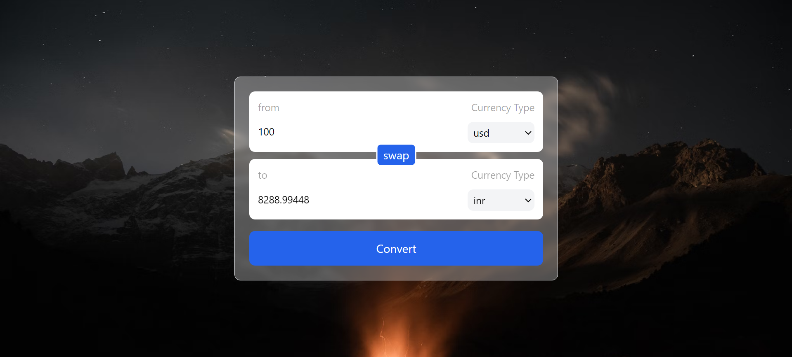

# CurrencyGenerator

CurrencyGenerator is a React + Vite application that allows users to fetch current currency prices using an API call and convert between different currencies. The application is styled using TailwindCSS.

## Features

- Fetch current currency prices via API calls.
- Convert one currency to another.
- Responsive design using TailwindCSS.

## Deployment Link

https://currency-generator-three.vercel.app/

## Demo



## Getting Started

### Prerequisites

- [Node.js](https://nodejs.org/) (version 14.x or later)
- npm

### Installation

1. Clone the repository:

   ```bash
   git clone https://github.com/namanmalhotra26/currencyGenerator.git
   cd currencyGenerator
   ```

2. Install the dependencies:

   ```bash
   npm install
   ```

3. Start the development server:

   ```bash
   npm run dev
   ```

4. Open your browser and navigate to `http://127.0.0.1:5173/` to see the application in action.

## Usage

1. Select the currency you want to convert from and to.
2. Enter the amount you want to convert.
3. Click the "Convert" button to see the converted amount.

## Technologies Used

- [React](https://reactjs.org/)
- [Vite](https://vitejs.dev/)
- [TailwindCSS](https://tailwindcss.com/)
- JavaScript
